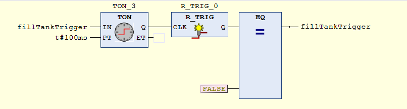

Mario Fentler 5CHIT
25.10.2018
# syt5-gk912-visualisierung

HMI ... Human Maschine Interface -> Oberfläche, damit der Arbeiter sieht was auf der Maschine abgeht. Sollte schön übersichtlich und auf einen schnellen Blick erkennbar sein, damit der Arbeiter im vorbeigehen schon sehen kann was los ist.

## Vorraussetzung
- Codesys
- Übung 1 Tankentleerung 

## Aufgabenstellung
Teste Programm und Visualisierung nach jeder Teilaufgabe ausführlich auf korrekte Funktion. Alle ursprünglichen Funktionen dürfen durch Änderungen nicht „beschädigt“ werden.  
Entscheide an welcher Stelle des Projektes Programmänderungen sinnvoll unterzubringen sind und begründe deine Entscheidung im Protokoll.

## Aufgabendurchführung
#### Visualisierungen erstellen
Um eine Visualisierung zu erstellen -> __Rechte Maustaste__ auf __Application__ -> __Objekt hinzufügen__ -> __Visualisierung__.  
Daraufhin muss man einen Namen vergeben und das Visualisierungsfenster wird geöffnet. (Objektbibliotheken auf aktiv setzen)

### Task1
_Erzeuge eine Visualisierung mit drei Schaltergrafiken für S1,S2,S3 und einer gelben Signallampe für V5. Diese soll leuchten, wenn V5 geöffnet ist und nicht leuchten wenn V5 geschlossen ist._  
_Die Visualisierungen sollen für einen Bildschirm mit 1024x768px gestaltet werden und „selbsterklärend“ sein, d.h. Gestaltung und Beschriftungen sollen dem Anwender des HMI helfen die Tankanlage einfach bedienen zu können._

Die Größe der Visualisierung lässt sich mit einem Doppelklick auf "TargetVisu" und dann unter den Skalierungsoptionen einstellen.  

Um die Aufgabe zu lösen werden 3 Kippschalter aus der Bibliothek auf der rechten Seite gewählt (Lampen/Schalter/Bilder Section). In den Einstellungen wählt man dann als __Variable__ die Variable s1, für den Schalter, aus dem Programm aus.

Nach dem man die 3 Schalter und die LED für die Visualisierung des Ventil5 gesetzt hat und man die Applikation dann ausführt, kann man sehen, dass die LED leuchtet sobald man den Schalter umschaltet.  

### Task2
_Erweitere die Visualisierung um einen Taster, der den Sensor S7 (Überlauf) simulieren soll,  sowie um ein Standardisiertes Ventilsymbol für V9 (Einlaufventil), das bei geöffnetem Ventil grün und bei geschlossenem Ventil weiß angezeigt wird (Rand ist immer schwarz)._

Dazu wählt man aus der Objektbibliothek (siehe Bild) einen Taster aus. Diesem weist man die Überlaufssensorvariable s7 zu.  

__Damit das funktioniert__ muss zuerst der Code aus dem strukturierten Text File von der Vorübung entfernt werden. Denn dieser überprüft ob die Maximalwasserhöhe erreicht ist und setzt die Variable dementsprechend. 

Als Symbol für das Einlaufventil V9 wird ein Polygon verwendet, das im __aktiven__ Zustand __grün__ und im __passiven__ Zustand __weiß__ gefüllt sein soll. Der Rand soll immer Schwarz sein. (alle 8 Sekunden für 5 Sekunden aktiv außer Überlaufsensor s7 aktiv)  

Dem Polygon weißt man die Variable unter "__Filter/Eingabe__"  und die Farben über "__Filter/Farben__" zu.

### Task3
_Um den Füllstand des Tanks zu visualisieren müssen im Projekt Kenngrößen nachgerüstet werden. Diese sollen sich in der Visualisierung bearbeiten lassen:_  

- __die Tankkapazität (in l):__  
einstellbar mit Eingabefeld zwischen 50 und 500 l  
- __die Füllgeschwindigkeit (in l/s):__  
einstellbar mit Schieberegler zwischen 10 und 40 l/s  
- __die Entleerungsgeschwindigkeit (in l/s):__  
einstellbar mit Schieberegler zwischen 8 und 20 l/s  

Für diesen Task müssen ein Eingabefeld und zwei Schieberegler zur HMI hinzugefügt werden. Diese findet man unter den allgemeinen Steuerelementen (unsichtbare Eingabe und Schieberegler)  

#### Schieberegler
Bei den Schiebereglern kann man den Skalabegin und das Skalaende in den Einstellungen festlegen. Weiters kann man auch Einstellen, dass die Skala angezeigt wird.  
Die Regler können dann so aussehen:  

Um diese Regler in der Applikation zu verwenden muss man ihnen auch eine Variable zuweisen. Diese Variable wird im "FillTank" Programm hinzugefügt.  
Als letzte Einstellung wird beim Schieberegler noch das Kästchen "zum Klick springen" aktiviert, da man so die Userbility des Programms steigern kann.

#### Eingabefeld
Für das Eingabefeld wird ein __"unsichtbares Eingabefeld"__
ausgewählt. Man kann das leider nicht auf visible setzen.

In diesem Feld wird die Eigenschaft "OnClick" konfiguriert. Dort wählt man folgende Optionen:

__WICHTIG:__  
Man muss eine Variable zur Bearbeitung eingeben (diese wird zuerst auch noch im Programm deklariert). Ansonsten funktioniert es nicht. Um dann im laufenden Programm eine Eingabe zu machen klickt man in das Textfeld und gibt einen Wert zwischen Min(50) und Max(500) ein.  
Wenn der Wert größer oder kleiner ist, dann kann die Eingabe nicht gesetzt werden.  

Das kann dann so aussehen:

### Task4
_Der aktuelle Füllstand soll über ein Zeigerinstrument visualisiert werden (0 – Tankkapazität in l). Passe nun das Projekt so an, dass der aktuelle Füllstand korrekt aktualisiert wird, wenn Einlauf- und Entleerungsventile geöffnet/geschlossen werden._  
_Es darf idealisiert angenommen werden, dass die Ventile unmittelbar (in einem Zyklus) den Durchfluss beeinflussen (100% → 0 und umgekehrt)._

Das Zeigerelement ist unter dem Reiter "Messgeräte" zu finden. Als Skala-Maximum wählt man die Variable für den Maximalinhalt des Tanks, die wir vorher erstellt haben.

Bei diesem Element gibt es die Option __"Variable"__ nicht. Stattdessen wird hier die Option __"Wert"__ verwendet. Dort gibt man eine Variable für den aktuellen Tankinhalt an, der dann durch den Zeiger visualisiert wird.  
Weiters kann man sich mit den Einstellungen von dem Zeigerelement spielen und auch dem __Maximum__ die Variable geben, die man im Eingabefeld "Tankkapazität" eingegeben hat.

  

Weiters wird eine neues Programm (Strukturierter Text eingefügt). In dieser Anwendung wird die eigentliche Tankbefüllung gemacht.  

#### Task4 - Programmierung
Zunächst muss ein Timer eingebaut werden, der als Trigger zum Befüllen/Entleeren des Tanks wirkt. Dieser schaltet alle 100ms auf True.  
Dieser Timer wird in ein neues Netzwerk eingefügt (siehe Bild).

  

Desweiteren wird ein __neues Programm__ mit der Programmiersprache "Stukturierter Text" eingefügt. In diesem werden die Ventile überprüft und gegebenenfalls der __Tank befüllt/entleert oder beides gleichzeitig__.

__Variablen des Programms:__

    PROGRAM TankManager
    VAR
        ventil9 : BOOL;
        ventil5 : BOOL;
        fillTankTimer : BOOL;
        
        maxTank : INT := 250;
        fuellGeschwindigkeit : REAL := 10;
        entleerGeschwindigkeit: REAL := 8;
        aktuellerTankInhalt : REAL := 0;
    END_VAR 

__Variablenzuweisung:__

    ventil9 := Programm3_FillTank.v9;
    ventil5 := Programm4_EigenerFUP.Ventil5;
    fillTankTimer := Programm3_FillTank.fillTankTrigger;
__Syntax:__  

    //Wenn nur das Einlaufventil(v9) geöffnet ist
    IF (ventil9 = TRUE AND fillTankTimer = TRUE AND NOT ventil5 = TRUE) THEN
        aktuellerTankInhalt := aktuellerTankInhalt + fuellGeschwindigkeit;
    ELSIF (ventil9 = TRUE AND ventil5 = TRUE AND fillTankTimer = TRUE) THEN
        IF (aktuellerTankinhalt + fuellGeschwindigkeit - entleerGeschwindigkeit < 0) THEN
            //Weniger als 0 geht nicht
            aktuellerTankInhalt := 0;
        ELSE
            aktuellerTankInhalt := aktuellerTankinhalt + fuellGeschwindigkeit - entleerGeschwindigkeit;
        END_IF
    ELSIF (ventil5 = TRUE AND fillTankTimer = TRUE AND NOT ventil9 = TRUE) THEN
        IF ((aktuellerTankinhalt - entleerGeschwindigkeit) < 0) THEN
            aktuellerTankinhalt := 0;
        ELSE
            aktuellerTankinhalt := aktuellerTankinhalt - entleerGeschwindigkeit;
        END_IF
    END_IF

### Task5
_Um den Überlauf zu simulieren, wird ein zweites „Überlaufsignal“ S8 eingeführt, das dann aktiviert wird, wenn der Tank zu 95% voll ist. Ein Überlauf wird signalisiert, wenn S7 (durch Taster simuliert) oder S8 melden. Ein Überlauf soll durch eine rote Signallampe visualisiert werden._

Dazu wird eine neue rote Lampe in die Visualisierung eingebaut. Diese bekommt als Variable "S8" für den Überlauf.  
Bei der wird dann der aktuelle Tankinhalt in relation zum maximalen Inhalt berechnet. Wenn das mehr als 95% sind oder s7 true ist, dann Leuchtet die Lampe.

    IF(aktuellerTankInhalt >= maxTank/100*95) THEN
        s8 := TRUE;
    ELSE
        s8 := FALSE;
    END_IF

    IF(s8 = TRUE OR gvl.s7 = TRUE) THEN
        ueberlaufLampe := TRUE;
    ELSE
        ueberlaufLampe := FALSE;
    END_IF

### Task6

## Quellen
[1] https://infosys.beckhoff.com/index.php?content=../content/1031/tcplccontrol/html/tcplcctrl_iec_operators_overview.htm&id=8653966830076413975  
[2] https://infosys.beckhoff.de/index.php?content=../content/1031/tcplccontrol/html/tcplcctrl_languages%20st.htm&id=5754912264349492758  